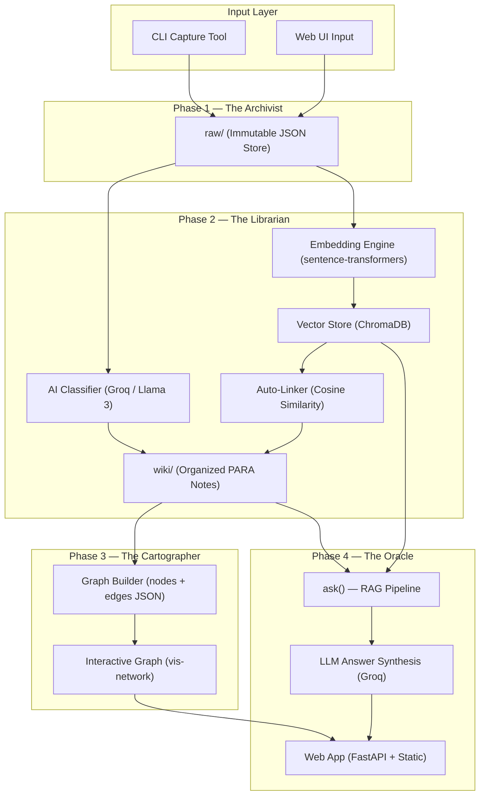
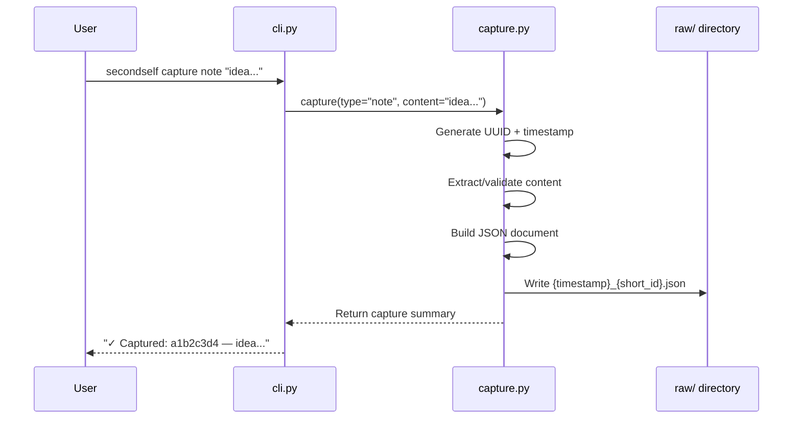
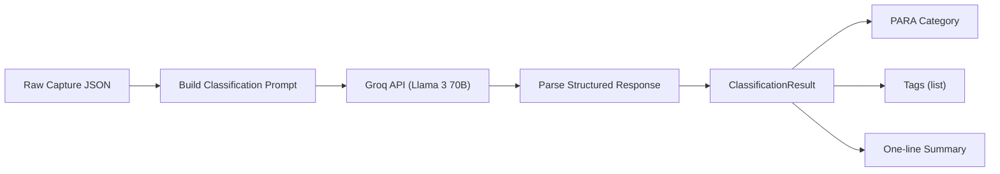
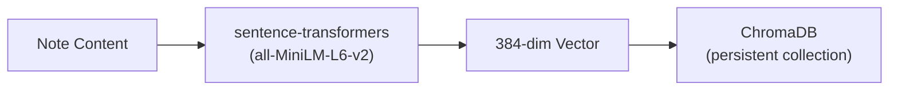
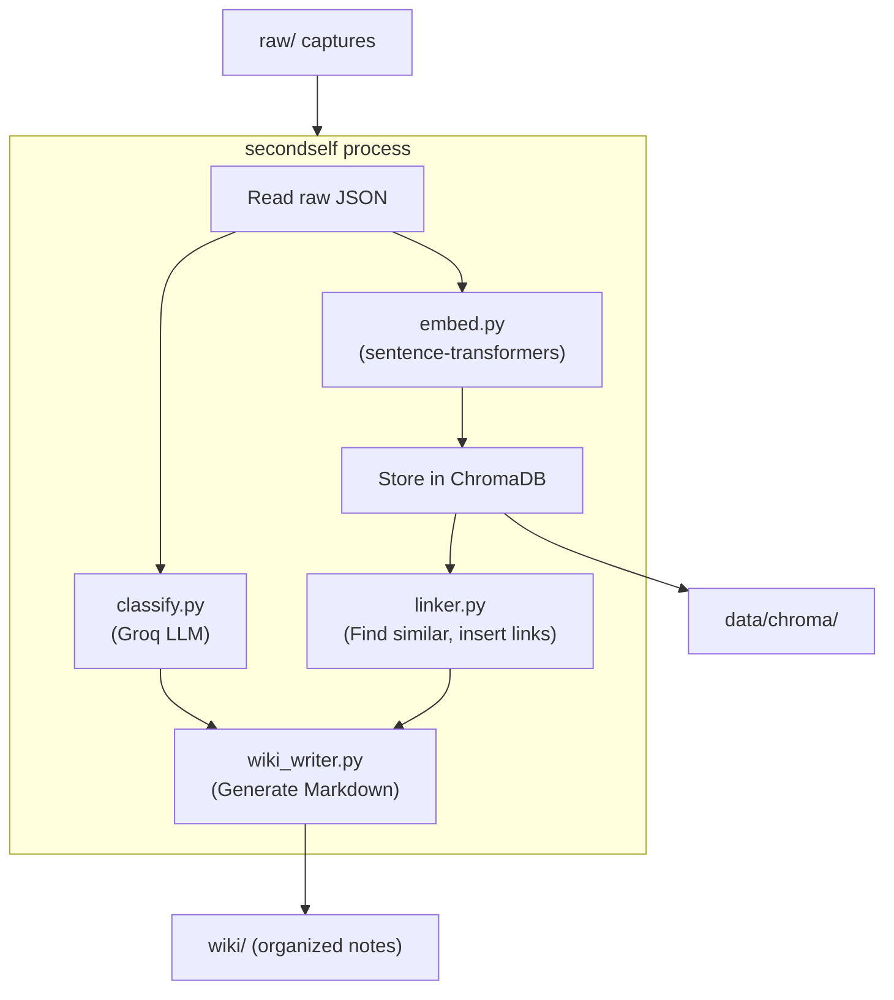
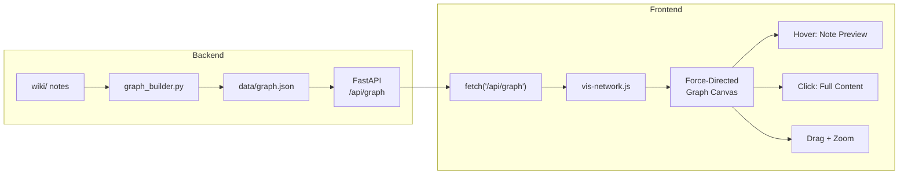
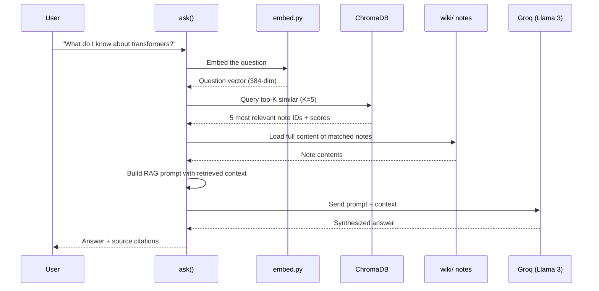
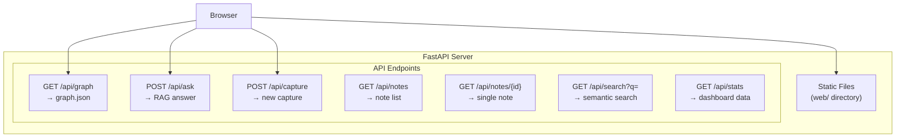
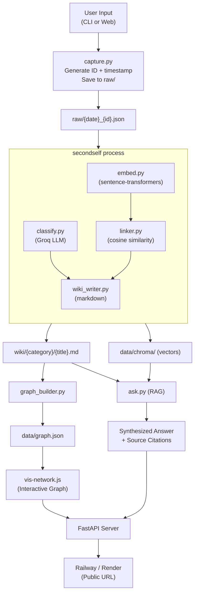
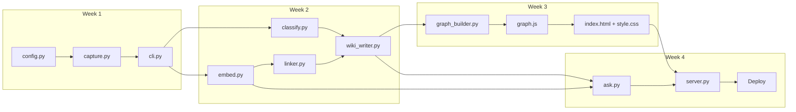

# SecondSelf — System Architecture

A complete technical architecture for building an AI-powered personal knowledge management system ("Second Brain") that captures, classifies, links, visualizes, and answers questions from your own knowledge.

> **Note:** Your `PROBLEM_STATEMENT.md` is truncated at line 86 — the Week 4 UI/Deployment section is cut off. This architecture infers the remaining requirements (web UI + public deployment) from the surrounding context. Please verify or paste the missing content.

---

## High-Level System Overview



---

## Technology Stack

| Layer | Technology | Rationale |
|---|---|---|
| **Language** | Python 3.11+ | Dominant AI/ML ecosystem, excellent CLI tooling |
| **CLI Framework** | `click` | Clean decorator-based CLI, auto-generated help |
| **LLM (Classification + QA)** | Groq API (Llama 3 70B) | Free tier, fast inference, no GPU required |
| **Embeddings** | `sentence-transformers` (`all-MiniLM-L6-v2`) | Local, free, 384-dim vectors, fast |
| **Vector Store** | ChromaDB (persistent) | Embedded, zero-infra, Python-native |
| **Web Backend** | FastAPI | Async, auto-docs, serves both API + static |
| **Graph Visualization** | vis-network.js | Lightweight, force-directed, rich interaction |
| **Web Frontend** | Vanilla HTML/CSS/JS | No build step, served statically by FastAPI |
| **Deployment** | Railway / Render | Free tier, one-command deploy from Git |
| **Package Management** | `uv` | Fast, reliable Python package management |
| **Data Format** | JSON (raw captures), Markdown (wiki notes) | Human-readable, git-friendly |

---

## Project Directory Structure

```
secondself/
├── PROBLEM_STATEMENT.md
├── pyproject.toml              # Project metadata, dependencies, CLI entry points
├── uv.lock                    # Lockfile for reproducible installs
├── .env                       # API keys (GROQ_API_KEY) — .gitignored
├── .gitignore
├── README.md
│
├── raw/                       # Phase 1: Immutable capture store
│   ├── 20260715_a1b2c3d4.json
│   ├── 20260715_e5f6g7h8.json
│   └── ...
│
├── wiki/                      # Phase 2: Organized knowledge base
│   ├── projects/
│   │   └── secondself-build.md
│   ├── areas/
│   │   └── machine-learning.md
│   ├── resources/
│   │   └── python-best-practices.md
│   └── archives/
│       └── old-meeting-notes.md
│
├── data/                      # Persistent data stores
│   ├── chroma/                # ChromaDB vector database
│   ├── graph.json             # Exported nodes + edges for visualization
│   └── index.json             # Master index of all captures
│
├── src/
│   └── secondself/
│       ├── __init__.py
│       ├── cli.py             # CLI entry point (click commands)
│       ├── capture.py         # Phase 1: Capture logic
│       ├── classify.py        # Phase 2: LLM classification (PARA)
│       ├── embed.py           # Phase 2: Embedding generation + storage
│       ├── linker.py          # Phase 2: Auto-linking via similarity
│       ├── wiki_writer.py     # Phase 2: Markdown note generator
│       ├── graph_builder.py   # Phase 3: Build nodes/edges from wiki
│       ├── ask.py             # Phase 4: RAG query pipeline
│       ├── server.py          # Phase 4: FastAPI web server
│       └── config.py          # Shared config, paths, constants
│
├── web/                       # Phase 3+4: Static frontend
│   ├── index.html             # Main page (graph + chat)
│   ├── style.css              # Styling (dark mode, glassmorphism)
│   ├── graph.js               # vis-network graph rendering
│   ├── chat.js                # Chat/ask interface logic
│   └── assets/
│       └── logo.svg
│
└── tests/
    ├── test_capture.py
    ├── test_classify.py
    ├── test_embed.py
    ├── test_linker.py
    ├── test_graph.py
    └── test_ask.py
```

---

## Phase 1: The Archivist — Capture Pipeline

### Data Model: Raw Capture

Every capture is stored as an immutable JSON file in `raw/`:

```json
{
  "id": "a1b2c3d4-e5f6-7890-abcd-ef1234567890",
  "timestamp": "2026-07-15T01:30:00+05:30",
  "type": "note | url | file",
  "source": "cli",
  "content": {
    "text": "The actual note text or extracted content",
    "url": "https://example.com (if type=url)",
    "file_path": "original/path.pdf (if type=file)",
    "file_content": "Extracted text from file (if type=file)"
  },
  "metadata": {
    "title": "Auto-generated or user-provided title",
    "word_count": 142,
    "char_count": 856
  }
}
```

### CLI Interface

```
secondself capture note "Your note text here"
secondself capture url "https://example.com"
secondself capture file "./path/to/document.pdf"
secondself list                    # List all captures
secondself show <id>               # Show a specific capture
```

### Architecture: `capture.py`



### Key Design Decisions — Phase 1

| Decision | Choice | Why |
|---|---|---|
| **Storage format** | Individual JSON files | Human-readable, git-friendly, no DB dependency |
| **Filename pattern** | `{YYYYMMDD}_{8-char-uuid}.json` | Chronological sorting + uniqueness |
| **Immutability** | Never modify raw files | Audit trail; classification writes to `wiki/` instead |
| **URL handling** | Fetch page title + meta description | Enrich captures without heavy scraping |
| **File handling** | Extract text (PDF via `pymupdf`, text files directly) | Store searchable content, not just paths |

---

## Phase 2: The Librarian — Classification + Auto-Linking

### Sub-system A: AI Classifier (`classify.py`)



**Classification Prompt Strategy:**

```
You are a personal knowledge management assistant.
Classify the following note using the PARA method:
- Projects: Active goals with deadlines
- Areas: Ongoing responsibilities  
- Resources: Topics of interest / reference material
- Archives: Inactive/completed items

Return JSON:
{
  "category": "projects|areas|resources|archives",
  "tags": ["tag1", "tag2", "tag3"],
  "summary": "One-line summary of the content",
  "suggested_title": "Short descriptive title"
}

Note content:
---
{content}
---
```

**Output: `ClassificationResult` dataclass:**

```python
@dataclass
class ClassificationResult:
    category: str          # "projects" | "areas" | "resources" | "archives"
    tags: list[str]        # ["python", "machine-learning", "tutorial"]
    summary: str           # "A guide to building neural networks in PyTorch"
    suggested_title: str   # "PyTorch Neural Network Guide"
    confidence: float      # 0.0–1.0 (from LLM self-assessment)
```

### Sub-system B: Embedding Engine (`embed.py`)



**ChromaDB Collection Schema:**

| Field | Type | Description |
|---|---|---|
| `id` | string | Capture UUID |
| `embedding` | float[384] | Sentence-transformer vector |
| `document` | string | Full text content |
| `metadata.category` | string | PARA category |
| `metadata.tags` | string (JSON) | Serialized tag list |
| `metadata.title` | string | Note title |
| `metadata.timestamp` | string | ISO timestamp |
| `metadata.source_file` | string | Path to raw JSON |

### Sub-system C: Auto-Linker (`linker.py`)

```mermaid
sequenceDiagram
    participant New as New Note
    participant Embed as embed.py
    participant Chroma as ChromaDB
    participant Link as linker.py
    participant Wiki as wiki/ notes

    New->>Embed: Generate embedding
    Embed->>Chroma: Query top-K similar (K=5)
    Chroma-->>Link: Similar notes + scores
    Link->>Link: Filter by threshold (≥ 0.65)
    Link->>Wiki: Insert bidirectional [[links]]
    Link->>Wiki: Update related notes' link sections
```

**Linking Rules:**

| Rule | Value | Rationale |
|---|---|---|
| **Similarity threshold** | `≥ 0.65` cosine | Balanced — catches related notes without over-linking |
| **Max links per note** | 5 | Prevents clutter; top-5 most relevant |
| **Link format** | `[[note-title]]` wiki-style | Parseable, human-readable in markdown |
| **Bidirectional** | Yes | If A links to B, B links back to A |

### Sub-system D: Wiki Writer (`wiki_writer.py`)

Transforms classified captures into organized Markdown files:

```markdown
---
id: a1b2c3d4-e5f6-7890-abcd-ef1234567890
title: PyTorch Neural Network Guide
category: resources
tags: [python, machine-learning, tutorial]
created: 2026-07-15T01:30:00+05:30
source: raw/20260715_a1b2c3d4.json
---

# PyTorch Neural Network Guide

A guide to building neural networks in PyTorch...

[Original captured content here]

## Related Notes
- [[Transformer Architecture Notes]]
- [[Python Best Practices]]
- [[Deep Learning Project Plan]]
```

**File placement:** `wiki/{category}/{slugified-title}.md`

### Full Phase 2 Pipeline



**CLI Commands (Phase 2):**

```
secondself process              # Process all unprocessed raw captures
secondself process <id>         # Process a specific capture
secondself reprocess            # Re-classify + re-link everything
secondself search "query"       # Semantic search over embeddings
```

---

## Phase 3: The Cartographer — Knowledge Graph

### Graph Data Model (`graph_builder.py`)

```json
{
  "nodes": [
    {
      "id": "a1b2c3d4",
      "label": "PyTorch Neural Network Guide",
      "category": "resources",
      "tags": ["python", "machine-learning"],
      "summary": "A guide to building neural networks...",
      "content_preview": "First 200 chars of note...",
      "created": "2026-07-15T01:30:00+05:30",
      "link_count": 3,
      "word_count": 450
    }
  ],
  "edges": [
    {
      "from": "a1b2c3d4",
      "to": "b2c3d4e5",
      "similarity": 0.82,
      "label": "related"
    }
  ],
  "metadata": {
    "total_nodes": 25,
    "total_edges": 40,
    "categories": {
      "projects": 5,
      "areas": 8,
      "resources": 10,
      "archives": 2
    },
    "generated_at": "2026-07-15T02:00:00+05:30"
  }
}
```

### Graph Visualization Architecture



### Visual Design Specifications

| Element | Design |
|---|---|
| **Node color** | By PARA category — Projects: `#6C5CE7`, Areas: `#00B894`, Resources: `#0984E3`, Archives: `#636E72` |
| **Node size** | Proportional to `link_count` (more connected = larger) |
| **Node pulse** | Subtle breathing animation on recently created notes |
| **Edge thickness** | Proportional to `similarity` score |
| **Edge color** | Gradient from source to target node color |
| **Hover popup** | Glassmorphic card with title, summary, tags, preview |
| **Background** | Deep dark (`#0a0a1a`) with subtle grid pattern |
| **Physics** | `barnesHut` solver, gravity: -3000, damping: 0.3 |

---

## Phase 4: The Oracle — RAG + Deployment

### RAG Pipeline (`ask.py`)



**RAG Prompt Template:**

```
You are an AI assistant answering questions using ONLY the user's 
personal knowledge base. Do not make up information.

Retrieved notes from the user's knowledge base:
---
[Note 1: {title}]
{content}

[Note 2: {title}]
{content}

[Note 3: {title}]
{content}
---

Question: {user_question}

Instructions:
1. Answer using ONLY information from the retrieved notes above.
2. Cite which note(s) your answer comes from using [Note X] format.
3. If the notes don't contain enough info, say so honestly.
4. Keep your answer concise and direct.
```

**Answer Response Model:**

```python
@dataclass
class AskResponse:
    answer: str                    # Synthesized answer text
    sources: list[SourceNote]      # Notes used to build the answer
    confidence: str                # "high" | "medium" | "low"
    query_embedding_time_ms: float
    retrieval_time_ms: float
    llm_time_ms: float

@dataclass
class SourceNote:
    id: str
    title: str
    similarity: float
    excerpt: str                   # Relevant excerpt from the note
```

### Web Application Architecture (`server.py`)



### API Endpoints

| Method | Path | Description | Request | Response |
|---|---|---|---|---|
| `GET` | `/` | Serve main web app | — | `index.html` |
| `GET` | `/api/graph` | Get graph data | — | `{ nodes: [], edges: [] }` |
| `POST` | `/api/ask` | Ask a question | `{ question: str }` | `AskResponse` |
| `POST` | `/api/capture` | Capture from web UI | `{ type, content }` | `{ id, status }` |
| `GET` | `/api/notes` | List all notes | `?category=&tag=` | `[NoteSummary]` |
| `GET` | `/api/notes/{id}` | Get single note | — | `NoteDetail` |
| `GET` | `/api/search` | Semantic search | `?q=query&k=5` | `[SearchResult]` |
| `GET` | `/api/stats` | Dashboard stats | — | `{ counts, recent }` |

### Web UI Layout

```
┌──────────────────────────────────────────────────────────┐
│  🧠 SecondSelf                              [Capture +]  │
├────────────────────────────┬─────────────────────────────┤
│                            │                             │
│                            │   Note Detail Panel         │
│   Interactive Knowledge    │   ┌───────────────────┐     │
│   Graph (vis-network)      │   │ Title             │     │
│                            │   │ Category · Tags   │     │
│   ● ──── ●                 │   │                   │     │
│     \   / \                │   │ Full content...   │     │
│      ● ── ●                │   │                   │     │
│     /                      │   │ Related: ●●●      │     │
│   ●                        │   └───────────────────┘     │
│                            │                             │
├────────────────────────────┴─────────────────────────────┤
│  💬 Ask your brain...                          [Send ➤]  │
│  ┌──────────────────────────────────────────────────┐    │
│  │ Answer appears here with [source citations]...   │    │
│  └──────────────────────────────────────────────────┘    │
└──────────────────────────────────────────────────────────┘
```

---

## Data Flow — End-to-End Pipeline



---

## Dependency Graph (Build Order)



---

## Configuration & Environment

### `config.py` — Central Configuration

```python
from pathlib import Path

# Paths
PROJECT_ROOT = Path(__file__).parent.parent.parent
RAW_DIR = PROJECT_ROOT / "raw"
WIKI_DIR = PROJECT_ROOT / "wiki"
DATA_DIR = PROJECT_ROOT / "data"
CHROMA_DIR = DATA_DIR / "chroma"
GRAPH_JSON = DATA_DIR / "graph.json"
INDEX_JSON = DATA_DIR / "index.json"
WEB_DIR = PROJECT_ROOT / "web"

# PARA Categories
PARA_CATEGORIES = ["projects", "areas", "resources", "archives"]

# Embedding
EMBEDDING_MODEL = "all-MiniLM-L6-v2"
EMBEDDING_DIM = 384

# Linking
SIMILARITY_THRESHOLD = 0.65
MAX_LINKS_PER_NOTE = 5
TOP_K_RETRIEVAL = 5

# LLM
LLM_PROVIDER = "groq"
LLM_MODEL = "llama3-70b-8192"

# Server
HOST = "0.0.0.0"
PORT = 8000
```

### `pyproject.toml` — Dependencies

```toml
[project]
name = "secondself"
version = "0.1.0"
requires-python = ">=3.11"

dependencies = [
    "click>=8.1",
    "sentence-transformers>=2.2",
    "chromadb>=0.4",
    "groq>=0.4",
    "fastapi>=0.110",
    "uvicorn[standard]>=0.27",
    "python-dotenv>=1.0",
    "httpx>=0.27",
    "pymupdf>=1.24",
    "rich>=13.0",
]

[project.scripts]
secondself = "secondself.cli:main"

[build-system]
requires = ["hatchling"]
build-backend = "hatchling.build"
```

---

## Key Architectural Decisions

| # | Decision | Choice | Alternatives Considered | Rationale |
|---|---|---|---|---|
| 1 | **Storage** | Flat JSON files + ChromaDB | SQLite, PostgreSQL | Zero-infra, git-trackable, human-readable |
| 2 | **Embedding model** | `all-MiniLM-L6-v2` | OpenAI Ada, Cohere | Free, local, fast, good quality for short texts |
| 3 | **Vector DB** | ChromaDB (persistent mode) | FAISS, Pinecone, Weaviate | Embedded (no server), Python-native, persistent |
| 4 | **LLM** | Groq (Llama 3 70B) | OpenAI GPT-4, local Ollama | Free tier, extremely fast, good quality |
| 5 | **Wiki format** | Markdown with YAML frontmatter | JSON, HTML, Notion API | Human-editable, renders natively, parseable |
| 6 | **Graph library** | vis-network.js | Cytoscape.js, D3.js, Sigma.js | Best balance of features vs complexity, rich interaction out-of-box |
| 7 | **Web framework** | FastAPI | Flask, Django, Express | Async, auto OpenAPI docs, serves static + API |
| 8 | **Deployment** | Railway | Vercel, Fly.io, Heroku | Free tier, Git push to deploy, Python support |

---

## Verification Plan

### Automated Tests
- `pytest tests/` — Unit tests for each module (capture, classify, embed, linker, graph, ask)
- Each phase includes integration tests against real captured data

### Manual Verification
- **Phase 1:** Capture 10+ real items via CLI, verify JSON structure in `raw/`
- **Phase 2:** Process all captures, verify `wiki/` organization and cross-links
- **Phase 3:** Open graph in browser, verify hover/drag/zoom with real data
- **Phase 4:** Ask 5+ real questions, verify answers cite correct sources; deploy to public URL
